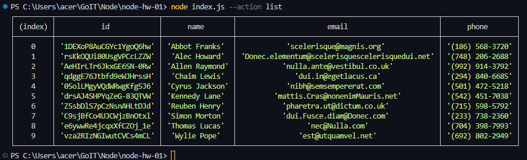
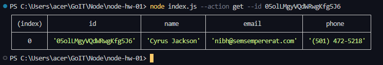
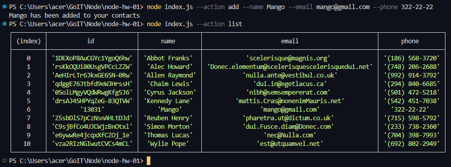
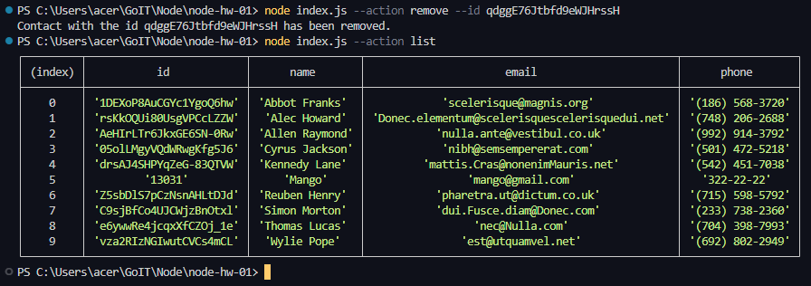

Comandos para ejecutar en el terminal:

//lista de usuarios
node index.js --action list

//usuario por id
node index.js --action get --id 05olLMgyVQdWRwgKfg5J6

//agregar un usuario
node index.js --action add --name Mango --email mango@gmail.com --phone 322-22-22

//remover un usuario por ID
node index.js --action remove --id qdggE76Jtbfd9eWJHrssH

